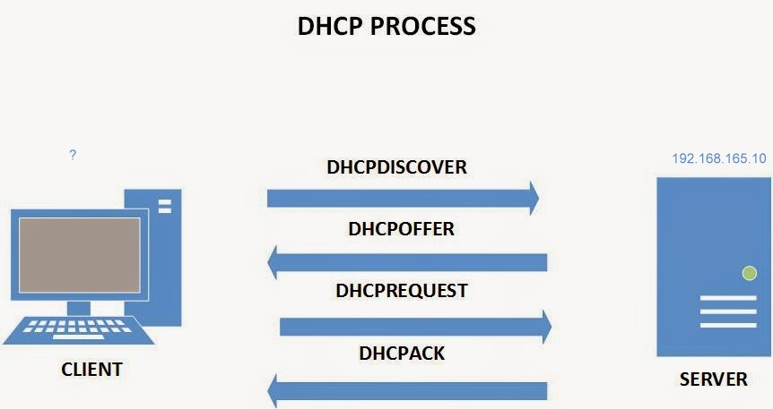

# Install and configure a DHCP Server on a Linux machine

The four steps we described are often called DORA: Discovery, Offer, Request, and Acknowledge:



(C->S)DHCP Discover(Broadcast)-I realy need an IP!:
```bash
Source Address: 0.0.0.0
Dest Address:   255.255.255.255
MAC Address :   4H-D5-6Y-7D-8L
```
(C<-S)DHCP Offer(Unicast or Broadcast):
```bash
Source Address: 192.168.165.10 (DHCP server IO)
Dest Address:   255.255.255.255
MAC Address :   4H-D5-6Y-7D-8L
Offered IP:     192.168.165.151
```
(C->S)DHCP Request(Broadcast):
```bash
Source Address: 0.0.0.0
Dest Address:   255.255.255.255
MAC Address :   4H-D5-6Y-7D-8L
Server IP:      192.168.165.10
Requested IP:   192.168.165.151
```
(C<-S)DHCP Ack:
```bash
Source Address: 192.168.165.10
Dest Address:   255.255.255.255
MAC Address :   4H-D5-6Y-7D-8L
Yay,Your IP:    192.168.165.151
```
An address that ends in ". 255" is a so-called broadcast address.
### Installation
On Debian base:
```bash
apt install isc-dhcp-server
```
On RedHat base:
```bash
yum install dhcp
```
My machine (DHCP Server)Detail:
```bash
Assigned static IP: 192.168.165.10
Distributor ID: Ubuntu
Description:    Ubuntu 22.04.1 LTS
Release:        22.04
Codename:       jammy
```
After installation complete lets watch the service status:

```bash
root@ubuntuserver-10:~# systemctl status isc-dhcp-server
```
and the service:
```bash
root@ubuntuserver-10:~# cat  /lib/systemd/system/isc-dhcp-server.service
[Unit]
Description=ISC DHCP IPv4 server
Documentation=man:dhcpd(8)
Wants=network-online.target
After=network-online.target
After=time-sync.target
ConditionPathExists=/etc/default/isc-dhcp-server
ConditionPathExists=|/etc/ltsp/dhcpd.conf
ConditionPathExists=|/etc/dhcp/dhcpd.conf

[Service]
EnvironmentFile=/etc/default/isc-dhcp-server
RuntimeDirectory=dhcp-server
# The leases files need to be root:dhcpd even when dropping privileges
ExecStart=/bin/sh -ec '\
    CONFIG_FILE=/etc/dhcp/dhcpd.conf; \
    if [ -f /etc/ltsp/dhcpd.conf ]; then CONFIG_FILE=/etc/ltsp/dhcpd.conf; fi; \
    [ -e /var/lib/dhcp/dhcpd.leases ] || touch /var/lib/dhcp/dhcpd.leases; \
    chown root:dhcpd /var/lib/dhcp /var/lib/dhcp/dhcpd.leases; \
    chmod 775 /var/lib/dhcp ; chmod 664 /var/lib/dhcp/dhcpd.leases; \
    exec dhcpd -user dhcpd -group dhcpd -f -4 -pf /run/dhcp-server/dhcpd.pid -cf $CONFIG_FILE $INTERFACESv4'

[Install]
WantedBy=multi-user.target
```
DHCP default port is 67. If you have other interfaces to listen to requests, you should modify the defaults in the DHCP default config:
```bash
cat /etc/default/isc-dhcp-server
# Defaults for isc-dhcp-server (sourced by /etc/init.d/isc-dhcp-server)

# Path to dhcpd's config file (default: /etc/dhcp/dhcpd.conf).
#DHCPDv4_CONF=/etc/dhcp/dhcpd.conf
#DHCPDv6_CONF=/etc/dhcp/dhcpd6.conf

# Path to dhcpd's PID file (default: /var/run/dhcpd.pid).
#DHCPDv4_PID=/var/run/dhcpd.pid
#DHCPDv6_PID=/var/run/dhcpd6.pid

# Additional options to start dhcpd with.
#       Don't use options -cf or -pf here; use DHCPD_CONF/ DHCPD_PID instead
#OPTIONS=""

# On what interfaces should the DHCP server (dhcpd) serve DHCP requests?
#       Separate multiple interfaces with spaces, e.g. "eth0 eth1".
INTERFACESv4="enp0s3"
INTERFACESv6=""

```
`INTERFACESv4=""` means all Intefaces. in my case I added my Interface.
`INTERFACESv4="enp0s3 enp0s8"` means listen on these Interface. 

DHCP database(assigned IPs)is stored in `/var/lib/dhcp/dhcpd.lease`.
The DHCP config file is located at /etc/dhcp/dhcpd.conf. You can modify it as needed.

```bash

subnet 192.168.165.0 netmask 255.255.255.0 {
  range 192.168.165.151 192.168.165.160;
  option routers 192.168.165.1;
  option domain-name-servers 4.2.2.4;
}

```
in this config:
Define your network Address: `subnet 192.168.165.0 netmask 255.255.255.0`
Our selected range for our pool:  `range 192.168.165.151 192.168.165.160;`
Option 1: `routers 192.168.165.1;` refers to a gateway or router on a particular network.
Option 2: `domain-name-servers 4.2.2.4;` It means DNS 
Other Options: `smtp-server , pop-server , nntp-server , time-server , routers , broadcast-address`

After modifying config files based on your needs, restart the service:
```bash
 systemctl restart isc-dhcp-server
```
Based on DORA you can follow the DHCP logs to see what happened(it will be filled after clients request an IP):
```bash
grep -i dhcpdiscover /var/log/syslog
grep -i dhcpoffer /var/log/syslog
grep -i dhcprequest /var/log/syslog
grep -i dhcpack /var/log/syslog
```
Its empty now, Let's configure CLIENTS interfaces:

On CentOS:
```bash
[root@centos-20 ~]# cat /etc/sysconfig/network-scripts/ifcfg-enp0s3 
TYPE="Ethernet"
PROXY_METHOD="none"
BROWSER_ONLY="no"
BOOTPROTO="dhcp"
DEFROUTE="yes"
IPV4_FAILURE_FATAL="no"
IPV6INIT="yes"
IPV6_AUTOCONF="yes"
IPV6_DEFROUTE="yes"
IPV6_FAILURE_FATAL="no"
IPV6_ADDR_GEN_MODE="stable-privacy"
NAME="enp0s3"
UUID="6d73f2dd-d578-4f6c-99df-55dc72ec9b7f"
DEVICE="enp0s3"
ONBOOT="yes"
IPV6_PRIVACY="no"
USERS="root"

```
Change `BOOTPROTO="none"` (default) to `BOOTPROTO="dhcp"` and restart network(or  `ifdown` then `ifup`):
```bash
systemctl restart network
```

After that, take a look at your IP and interface file:


Check the DORA log again:

##### Discover:
```bash
grep -i dhcpdiscover /var/log/syslog 
```
OutPut: 
```bash
Mar 28 16:24:38 ubuntuserver-10 dhcpd[2317]: DHCPDISCOVER from 08:00:67:38:06:42 via enp0s3
NOTICE: 08:00:67:38:06:42 is my CentOS MAC Address (changed for document). 
```
##### Offer:
```bash
grep -i dhcpoffer /var/log/syslog
```
OutPut:
```bash
Mar 28 16:24:39 ubuntuserver-10 dhcpd[2317]: DHCPOFFER on 192.168.165.151 to 08:00:67:38:06:42 (centos-20) via enp0s3
```
##### Request:
```bash
grep -i dhcprequest /var/log/syslog
```
OutPuts: 
```bash
         Mar 28 16:24:39 ubuntuserver-10 dhcpd[2317]: DHCPREQUEST for 192.168.165.151 (192.168.165.10) from 08:00:67:38:06:42 (centos-20) via enp0s3
         Mar 28 16:29:30 ubuntuserver-10 dhcpd[2317]: DHCPREQUEST for 192.168.165.151 from 08:00:67:38:06:42 (centos-20) via enp0s3
         Mar 28 16:33:56 ubuntuserver-10 dhcpd[2317]: DHCPREQUEST for 192.168.165.151 from 08:00:67:38:06:42 (centos-20) via enp0s3
```
##### Ack:
```bash
grep -i dhcpack /var/log/syslog
```
OutPuts: 
```bash
         Mar 28 16:24:39 ubuntuserver-10 dhcpd[2317]: DHCPACK on 192.168.165.151 to 08:00:67:38:06:42 (centos-20) via enp0s3
         Mar 28 16:29:30 ubuntuserver-10 dhcpd[2317]: DHCPACK on 192.168.165.151 to 08:00:67:38:06:42 (centos-20) via enp0s3
         Mar 28 16:33:56 ubuntuserver-10 dhcpd[2317]: DHCPACK on 192.168.165.151 to 08:00:67:38:06:42 (centos-20) via enp0s3
         Mar 28 16:38:18 ubuntuserver-10 dhcpd[2317]: DHCPACK on 192.168.165.151 to 08:00:67:38:06:42 (centos-20) via enp0s3
```
DHCP database has been updated:
```bash
root@ubuntuserver-10:/etc/dhcp# cat /var/lib/dhcp/dhcpd.leases

lease 192.168.165.152 {
  starts 4 2024/03/28 16:42:18;
  ends 4 2024/03/28 16:52:18;
  cltt 4 2024/03/28 16:42:18;
  binding state active;
  next binding state free;
  rewind binding state free;
  hardware ethernet 08:00:67:38:06:42;
  client-hostname "centos-20";
}
```

If you want to reserve an IP for a specific machine, you can add it in the DHCP config (`/etc/dhcp/dhcpd.conf`):
```bash
subnet 192.168.165.0 netmask 255.255.255.0 {
  range 192.168.165.151 192.168.165.160;
  option routers 192.168.165.1;
  option domain-name-servers 4.2.2.4;\
  
host samplename {
  hardware ethernet 19:11:78:49:07:43;
  fixed-address 192.168.165.159;
#Add other options...
}

```

##### group
If you have many static host entries for a single subnet, you can use the group statement to create a group of static IP address assignments that share the same default router, broadcast address, and subnet mask.
```bash
group {
  option routers 10.1.0.1;
  option broadcast-address 10.1.255.255;
  netmask 255.255.0.0;
  host shadrach {
       hardware ethernet 00:51:12:FE:DC:BA
       fixed-address 10.1.0.5;
       option host-name "shadrach";
 }
 host meshach {
     hardware ethernet 02:11:02:AB:CD:EF
     fixed-address 10.1.0.6;
     option host-name "meshach";
 }
}

```
##### shared-network
In the context of DHCP (Dynamic Host Configuration Protocol), a "shared-network" declaration in the DHCP configuration file refers to a configuration construct used to define multiple subnets that share the same physical network infrastructure.

When you have multiple subnets within the same physical network segment, you may want to configure DHCP to manage IP address allocation for devices on each of these subnets. However, since they share the same physical network infrastructure, there might be some configurations that are common to all subnets, such as:

    Common DHCP server settings
    DHCP options shared among all subnets
    Configuration for DHCP failover or load balancing

Using a shared-network declaration allows you to group these common configurations together, making the DHCP configuration more organized and manageable.

Here's a basic example of how a shared-network declaration might be used in a DHCP configuration file:

```bash
shared-network my_network {
    subnet 192.168.1.0 netmask 255.255.255.0 {
        range 192.168.1.10 192.168.1.50;
        option routers 192.168.1.1;
        option subnet-mask 255.255.255.0;
    }
    subnet 10.0.0.0 netmask 255.255.255.0 {
        range 10.0.0.10 10.0.0.50;
        option routers 10.0.0.1;
        option subnet-mask 255.255.255.0;
    }
}
```
In this example:
- Both subnets 192.168.1.0/24 and 10.0.0.0/24 are part of the same shared network, my_network.
- Each subnet has its own range of IP addresses and specific configuration options like routers and subnet masks.
- By grouping them within a shared-network declaration, you can manage common settings for both subnets more efficiently.

Using shared-network declarations helps in maintaining a clear and organized DHCP configuration, especially in scenarios where there are multiple subnets on the same physical network.
